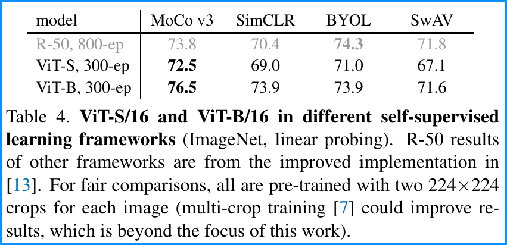

# HandyLatex

Collections of Beautiful Latex Snippets

## Table

:point_right: **Succinct table with bold separation line and gray text**

<center></center>

```latex
%################## Dependencies ##################
\usepackage{xcolor}
\definecolor{tablegray}{gray}{0.6}
\newcommand{\demph}[1]{\textcolor{tablegray}{#1}}

\usepackage{tabulary}
\newcolumntype{x}[1]{>{\centering\arraybackslash}p{#1pt}}
\newcommand{\tablestyle}[2]{\setlength{\tabcolsep}{#1}\renewcommand{\arraystretch}{#2}\centering\footnotesize}
\newlength\savewidth\newcommand\shline{\noalign{\global\savewidth\arrayrulewidth
        \global\arrayrulewidth 1pt}\hline\noalign{\global\arrayrulewidth\savewidth}}

%##################################################################################################
\begin{table}[t]
    \centering
    \tablestyle{4pt}{1.1}
    \begin{tabular}{l|x{32}x{32}x{32}x{32}}
        model & MoCo v3 & SimCLR & BYOL & SwAV \\
        \shline
        \demph{R-50, 800-ep} & \demph{73.8} & \demph{70.4} & \demph{\textbf{74.3}} & \demph{71.8} \\
        ViT-S, 300-ep & \textbf{72.5} & 69.0 & 71.0 & 67.1 \\
        ViT-B, 300-ep & \textbf{76.5} & 73.9 & 73.9 & 71.6 \\
    \end{tabular}
    \vspace{.5em}
    \caption{\textbf{ViT-S/16 and ViT-B/16 in different self-supervised learning frameworks} (ImageNet, linear probing).
        R-50 results of other frameworks are from the improved implementation in \cite{Chen2021}. For fair comparisons, all are pre-trained with two 224$\times$224 crops for each image (multi-crop training \cite{Caron2020} could improve results, which is beyond the focus of this work).
        \label{tab:vit_vs_frameworks}
    }
\end{table}
%##################################################################################################
```

Source: Table 4 from [An Empirical Study of Training Self-Supervised Vision Transformers](https://arxiv.org/abs/2104.02057) Table 4

## Pseudocode
